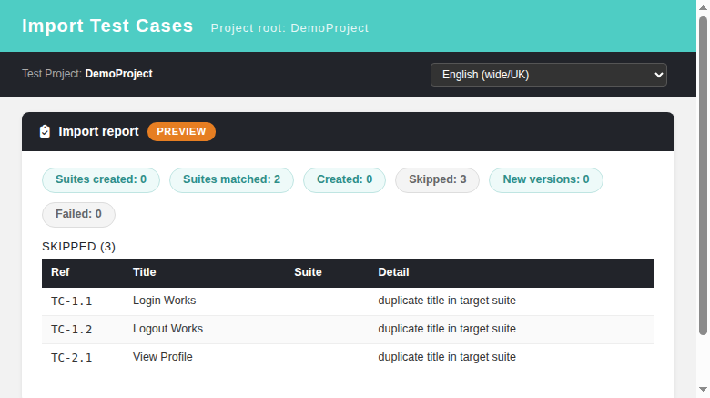
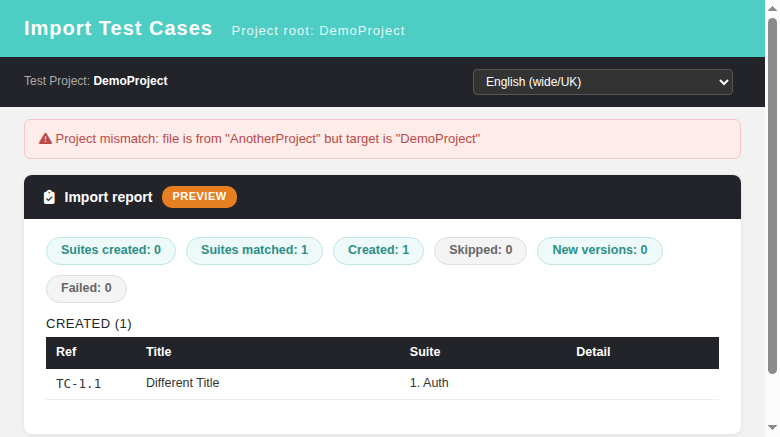

# MD Test Case Import — REST BFF API

**Endpoint:** `POST /api/testcasesimport/?action=import_md&tproject_id=<id>`
**Auth:** TestLink session (cookie), permission `mgt_modify_tc` on target project
**Parser:** `lib/functions/markdown_tc_import.class.php` (pure parser, no DB access)
**Format reference:** `tmp/TLU_Test_Cases.md`

## Request

| Param | Where | Notes |
|---|---|---|
| `tproject_id` | query | target test project (falls back to session project) |
| `markdown` | form field | the MD text; OR multipart file field `uploadedFile` |
| `dry_run` | query | `1` = parse + resolve + report, zero DB writes |
| `hit_criteria` | query | only `name` (legacy parity; others rejected with 400) |
| `action_on_hit` | query | `skip` (default) \| `create_new_version` |

Limits: payload larger than `import_file_max_size_bytes` → HTTP 413.

## Semantics
1. Metadata header is parsed (`Project/Prefix/Author/Date`). If the file names a
   different project than the target, response carries `projectMismatch` — caller decides.
2. Suites match by name (case-insensitive) anywhere in the project; missing ones are
   created under the project root.
3. Cases duplicate by title within the target suite → skipped or new version created.
4. Steps support `*Expected:*` inline markers; importance mapped High/Medium/Low → 3/2/1.
5. Response reports per-item arrays: `created`, `skipped`, `newVersions`, `failed`,
   plus `suitesCreated`, `suitesMatched`, `parserErrors`.

## Example

```
curl -b cookies.txt -X POST \
  -F "markdown=@TLU_Test_Cases.md" \
  "http://host/api/testcasesimport/?action=import_md&tproject_id=29&dry_run=1"
```

```json
{"status":"ok","dry_run":true,"createdCount":120,"skippedCount":0,
 "newVersionCount":0,"failedCount":0,"suitesCreated":["Header","Dashboard"],
 "parserErrors":[],
 "projectMismatch":{"file":"TLU: TestLink Upgraded 2.0.1","target":"MD Import Fixture"}}
```

## Verified behavior (suite 27 in tmp/TLU_Test_Cases.md)
dry-run no-write · real create with external IDs · idempotent re-import ·
create_new_version doubles tcversions · full-file dry run (122 cases/24 suites) ·
403 without rights · 413 over size limit · no Event Viewer pollution.

## Legacy parity notes (vs lib/testcases/tcImport.php)
Same permission model and size cap; duplicate criteria limited to `name`
(legacy also has internalID/externalID); actions limited to skip/create_new_version
(legacy also has update_last_version/generate_new) — backlog for later parity.

## Modernized UI (`gui/templates/testcases/tcImport.html`)

The import screen is modernized as a standalone HTML+JS+CSS page backed by the BFF above.

### Entry points (already switched)
- ASIDE/Test Specification: `Test Cases > Import Test Cases` (project root, `lib/functions/common.php:1895`)
- Test Specification > containerView Import button (`containerView.tpl:41-44`)
- Test Suite text buttons Import (`containerViewTestSuiteTextButtons.inc.tpl:129`, dashio + tl-classic)

### Features
- **File type selector** XML (legacy form passthrough → `lib/testcases/tcImport.php`) vs **Markdown (.md)** (BFF).
- MD mode: dry-run toggle → PREVIEW report with created/skipped/duplicate tables, **zero DB writes**;
  project-mismatch banner when file header names another project.
- Duplicate hit criteria (name-only for MD) + action for duplicates (skip / create new version).
- Client-side size guard (toast at `import_file_max_size_bytes`) before upload; server 413 backup.
- `mgt_modify_tc` gate: no-rights users see a lock notice and a disabled Upload button.
- Mandatory i18n via `TLi18n` — all labels keyed in every locale bundle.






## UI regression suite
Suite 63 in `tmp/TLU_Test_Cases.md` (11 test cases covering render, MD/XML toggle,
dry-run, real import + DB verify, idempotent re-import, project mismatch, oversize,
no-permission, XML passthrough, cancel, Event Viewer cleanliness).
