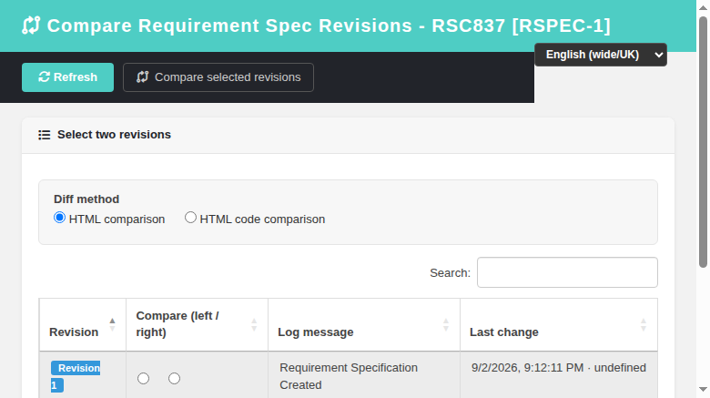
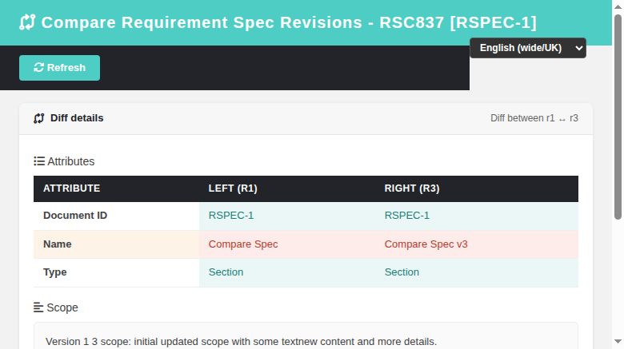

# Requirement Spec Revision Compare — Modernized Screen

Modernization of **Requirement Spec Revision Compare**
(`lib/requirements/reqSpecCompareRevisions.php`) — GitHub issue
[#837](https://github.com/sebiboga/testlink-upgraded/issues/837). This closes the
HIGH-priority `reqSpecViewRevisions` (revision compare) item of
[#755](https://github.com/sebiboga/testlink-upgraded/issues/755).

The legacy Smarty diff screen is replaced by a standalone Dashio page
(`gui/templates/requirements/reqSpecCompare.html`) backed by the requirement-spec
BFF (`api/reqspec/index.php`, new `spec_revision_compare` action). It is a
**non-ASIDE** screen reached from the modernized **Requirement Specification
Viewer** (`reqSpecView.html`) and **Spec Revision Viewer**
(`reqSpecViewRevision.html`) via the new "Compare revisions" button.

**URL:** `gui/templates/requirements/reqSpecCompare.html?spec_id=<spec_node_id>&tproject_id=<id>`
**BFF API:** `api/reqspec/index.php?action=spec_revision_compare`
**Rights:** `mgt_view_req` (view) enforced server-side (same gate as `spec_revision_view`).

---
## Table of Contents
1. [What the screen does](#1-what-the-screen-does)
2. [REST API Reference](#2-rest-api-reference)
3. [Legacy parity notes](#3-legacy-parity-notes)
4. [i18n Keys](#4-i18n-keys)
5. [Security](#5-security)
6. [Testing](#6-testing)

## 1. What the screen does

| Feature | Legacy behavior | Modern implementation |
|---|---|---|
| Revision picker | table of revisions (revision, left/right radios, log message, timestamp) | DataTable of revisions (ordered DESC) with two radio columns (left / right), log message, "last change" timestamp + editor; most recent two pre-selected |
| Diff method | radio `htmlCompare` (DaisyDiff) vs `htmlCodeCompare` (text `diff`/`inline` + context + show-all) | same two radio options; context input + "Show all" shown only in code-compare mode |
| Attributes diff | `getAttrDiff()` table (doc_id, name, type) with changed highlighting | same — attribute table with `changed` rows highlighted |
| Scope diff | `diff`/`HTMLDiffer` on the `scope` of each revision | same — HTML-ins/del or text diff table; "No changes" when equal |
| Custom fields diff | `getCFDiff()` table of linked CF values on each revision | same — CF table, `show_custom_fields_without_value` honored |
| Validation | two distinct revisions required, context must be numeric ≥ 0 | same client-side validation before the compare request |

## 2. REST API Reference

All routes are session-authenticated and JSON; CSRF Origin header required.

| Method | Route | Query | Returns |
|---|---|---|---|
| GET | `?action=spec_revision_compare` | `spec_id`, `tproject_id` | `{status, tproject_id, tproject_name, spec_id, spec_doc_id, revisions:[{item_id, revision, log_message, timestamp, last_editor}]}` |
| GET | `?action=spec_revision_compare` | `spec_id`, `tproject_id`, `left`, `right`, `method=html|text`, `context`, `context_show_all` | `{status, left, right, method, attributes:[{label,lvalue,rvalue,changed}], scope:{type,left,right,count,diff}, custom_fields:[{label,lvalue,rvalue,changed}]}` |

### Error conditions
- Missing/invalid session → HTTP 401.
- Unknown spec → 404 `Requirement specification not found`.
- Test project mismatch → 400.
- No `mgt_view_req` right on the owning test project → 403.
- `left`/`right` missing or equal → 400 `Select two different revisions to compare`.
- One/both revisions not found → 404.

## 3. Legacy parity notes

- The revision list comes from `requirement_spec_mgr->get_history()` (same as
  legacy), returning `item_id`/`revision`/`log_message`/`timestamp`/`last_editor`.
- The diff reads the full `req_specs_revisions` row (doc_id/name/type/scope) and
  linked **design custom fields** for each revision (1.x design-node sink), same as
  the modernized `spec_revision_view` action.
- Two diff engines are ported 1:1: `HTMLDiffer::htmlDiff` (HTML comparison) and
  `diff::doDiff` + `inline` (HTML code comparison with a context window).
- The `scope` is compared for both engines; attributes and custom fields use the
  legacy `changed` flag for row highlighting.

## 4. i18n Keys

All labels are client-side via `TLi18n`; keys under the `rsvc.` namespace
(`rsvc.title`, `rsvc.selectRevisions`, `rsvc.selectTwo`, `rsvc.sameSelected`,
`rsvc.noSpec`, `rsvc.noRevisions`, `rsvc.loadError`, `rsvc.diffMethod`,
`rsvc.htmlCompare`, `rsvc.codeCompare`, `rsvc.context`, `rsvc.showAll`,
`rsvc.revision`, `rsvc.compare`, `rsvc.logMessage`, `rsvc.timestamp`,
`rsvc.left`, `rsvc.right`, `rsvc.compareSelected`, `rsvc.invalidContext`,
`rsvc.computing`, `rsvc.diffDetails`, `rsvc.diffBetween`, `rsvc.attributes`,
`rsvc.attribute`, `rsvc.scope`, `rsvc.noChanges`, `rsvc.changes`,
`rsvc.customFields`, `rsvc.customField`). The link labels use
`rsv.compareRevisions` / `rsvr.compareRevisions`. Present in all 10 bundles
(`en ro de es fr it ja pt ru zh`).

## 5. Security

- Server-side rights check on every route: `mgt_view_req` required even to list
  revisions; the spec's owning test project is resolved from the `req_specs` row.
- CSRF guarded via Origin header check (all BFF routes).
- Output is HTML-escaped client-side; DB reads use parameterized queries /
  int-casts on every id.

## 6. Testing

See **Suite 837 — Requirement Spec Revision Compare** in `tmp/TLU_Test_Cases.md`
(13/13 PASS): revision list, HTML diff, code-compare diff, same-revision
validation, empty-context validation, missing-spec error, BFF 404/400 guards,
link switches from both the current-spec viewer and the revision viewer, locale
switch, console cleanliness, and Event Viewer cleanliness.
