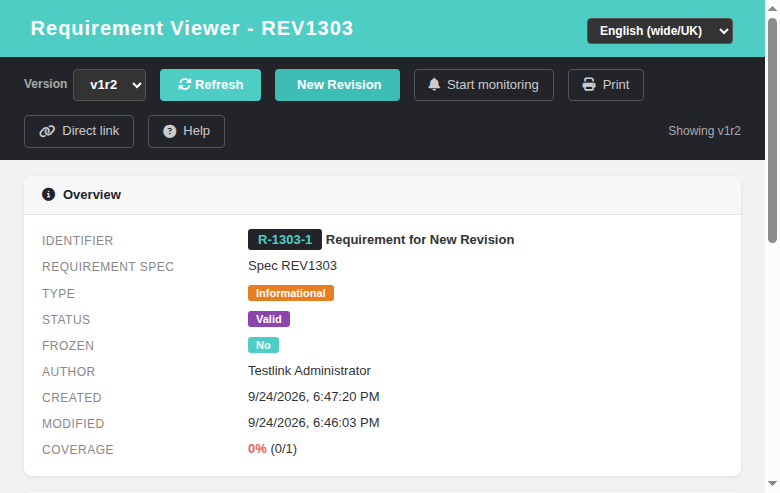
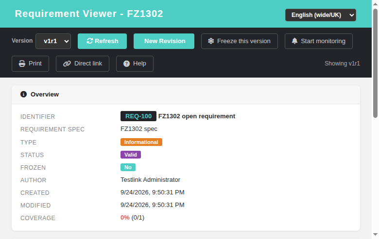
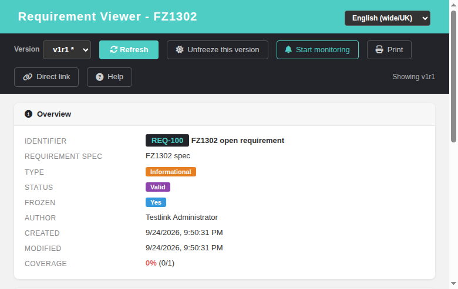
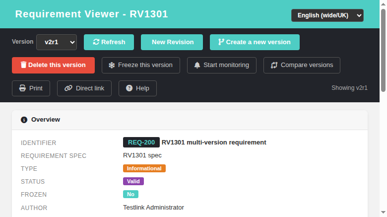

# Requirement Viewer (reqView)

Modernized screen: **Requirement Viewer** (opened from Requirement Overview,
Requirement Monitoring Overview and Search Requirements). Refs
[#755](https://github.com/sebiboga/testlink-upgraded/issues/755).

## What it does

Read-only detail view of a single requirement — the Dashio rewrite of the
legacy popup `lib/requirements/reqView.php`, backed by a new JSON BFF action
`GET /api/requirements/view`. Nothing from the legacy screen was dropped:

| Section | Content |
|---|---|
| Toolbar | version selector (`vN rM`, closed versions tagged `*`), refresh, **New Revision**, monitoring toggle, **Print**, **Direct link** (toggle), **Help** |
| Print | opens the new print screen `printReq.html` in a resizable popup |
| Direct link | shows the requirement permalink (`linkto.php?tprojectPrefix=<T>&item=req&id=<docID>`) plus a version-specific link and a **Copy** button (clipboard API with `execCommand` fallback; teal toast on success) |
| Help | links to the GitHub wiki Requirement-Viewer page |
| Overview | identifier (`docID`), requirement title, requirement spec path, type, status, frozen, author, created / modified, coverage `pct% (covered/expected)` |
| Scope | approval-scope note text (legacy *"approval scope"* field) |
| Custom fields | values of requirement-level custom fields (dates localized by the BFF) |
| Linked Test Cases | DataTables grid: TC external id, test case name (opens the modern `tcView.html`), TC version |
| Relations | DataTables grid: relation, target requirement (`docID : title`, clickable), project, status |
| Monitors | DataTables grid: user login of every user monitoring the requirement (gated on `monitor_requirement` right; shows empty-state message when no monitors) |

Deleted requirements show a "This requirement no longer exists" banner and
an empty version selector; the permission-denied path shows
"Failed to load requirement: No permission".

## Version selector & monitor

- The selector lists every version of the requirement (newest first); a
  trailing `*` marks closed (frozen) versions. Switching versions reloads the
  whole view for that version.
- **Start/Stop monitoring** hits the existing `POST /api/requirements/monitor`
  action (`{reqId, action:'on'|'off'}`). Monitoring is per **requirement**
  (legacy parity), so the state survives version switches.
- The **Print** toolbar button opens
  `gui/templates/requirements/printReq.html?req_id&req_version_id&req_revision&tproject_id`
  in a popup. The print screen mirrors `tcPrint.html`: it calls
  `GET /api/requirements/index.php?action=req_print` and embeds the legacy
  generator output (`lib/requirements/reqPrint.php`) in a sandboxed iframe
  (Print / Back / Refresh toolbar, inline-anchor navigation, localized error
  banner on failure). The BFF resolves the requested revision (falling back to
  the version's stored revision) — without it the legacy generator crashed with
  a DB error.
- The **Direct link** toggle shows the requirement permalink
  (`basehref` + `linkto.php?tprojectPrefix=<code>&item=req&id=<docID>`,
  legacy `reqView.php` formula) and re-renders the version-specific link when
  the version selector changes.

## New Revision (Refs #1303)

Port of the legacy `reqViewVersionsViewer.tpl` "New Revision" button
(`doAction=doCreateRevision`) into the modern toolbar:

- **Button visibility** mirrors the legacy gates exactly
  (`reqViewVersionsViewer.tpl:49,62,106-111`): shown only when the caller has
  the `mgt_modify_req` grant (`req_mgmt`) on the requirement's own test project
  AND the displayed version is **open** (`is_open = 1`, i.e. not frozen).
- **Log prompt**: clicking opens `window.prompt` with
  `reqv.newRevisionPrompt` ("Revision log message:") — the modern equivalent of
  the legacy `ask4log()` callback. Cancel is a clean no-op; the prompt may be
  submitted empty (legacy parity).
- **Server-side write** `POST /api/requirements/index.php/versions/{id}/revision`
  with `{log_message}`: re-checks `mgt_modify_req` on the owning project
  (HTTP 403), rejects frozen versions (HTTP 409), 404s on unknown version ids.
  It mirrors `reqCommands::doCreateRevision` → `requirement_mgr::create_new_revision`:
  snapshots the version row into `req_revisions` (scope/status/type + custom
  fields via `copy_cfields`), keeps the OLD `log_message` in the snapshot
  (legacy `copy_version_as_revision` SELECT), then bumps `req_versions.revision`
  (+1), stamps `creation_ts`/`author_id` and stores the NEW log message.
- **Feedback**: teal toast `reqv.revisionCreated` and the whole view reloads —
  the version selector now reads `vN rM+1` and the history/compare features
  show the new snapshot.
- No audit event is emitted on purpose: legacy `doCreateRevision` emits none
  and no locale key exists (a `TLS()` call would raise a Not-localized Event
  Viewer warning); the revision journal lives in `req_revisions`.

## Freeze / Unfreeze version (Refs #1302)

Port of the legacy `reqViewVersionsViewer.tpl` "Freeze this version" /
"Unfreeze this version" buttons (`doAction=doFreezeVersion|doUnfreezeVersion`)
into the modern toolbar:

- **Grants** mirror the legacy exactly: a SINGLE grant `unfreeze_req` (right
  `mgt_unfreeze_req`) gates **both** directions — the schema has no separate
  `freeze_req` right. The `/view` BFF grant block now exposes `unfreeze_req`
  alongside the others. Button visibility additionally requires `req_mgmt`,
  because legacy renders the whole buttons form only inside
  `{if $args_grants->req_mgmt == "yes"}` (tpl:49,86-98).
- **State gating**: Freeze renders only for **open** versions, Unfreeze only
  for **frozen** ones (legacy `reqView.php` `is_open` check).
- **Confirm dialog** carries the version/docId/title, matching the legacy
  `warning_freeze_requirement` / `warning_unfreeze_requirement` fill:
  "You are going to freeze version {v} - {docId}: {title}. Are you sure?".
- **Server-side write** `POST /api/requirements/index.php/versions/{id}/freeze`
  and `/versions/{id}/unfreeze`: both 403 unless the caller has `mgt_modify_req`
  AND `mgt_unfreeze_req` on the version's OWNING project (legacy reqEdit.php:315
  page gate + tpl grant), 404 on unknown version id. They mirror
  `reqCommands::doFreezeVersion` / `doUnfreezeVersion` →
  `requirement_mgr::updateOpen($versionId, false|true)` (writes
  `req_versions.is_open`: 0 = frozen, 1 = open). Idempotent per legacy: no 409
  state pre-check.
- **Audit events** (legacy parity): `logAuditEvent(..., 'FREEZE'|'UNFREEZE',
  $versionId, 'req_version')` with the literal legacy wording
  " Version {v} of Req 'DOCID:{docId}' - {title} was frozen/unfrozen.".
- **Feedback**: teal toast `reqv.frozenOk` / `reqv.unfrozenOk` and the view
  reloads — Frozen badge Yes, version selector shows `vN rM *`, and the New
  Revision button disappears for frozen versions.

## New Version / Delete Version (Refs #1301)

Port of the legacy `reqViewVersionsViewer.tpl` "Create a new version" (tpl:113-
114) and "Delete this version" (tpl:76-81) buttons (`doAction=doCreateVersion` /
`doDeleteVersion`, `reqCommands.class.php:609,632`) into the modern toolbar,
placed next to the New Revision button:

- **New Version button** — gated ONLY on the `req_mgmt` grant (right
  `mgt_modify_req` on the requirement's own test project). Legacy renders it
  inside the req_mgmt form but NOT on the frozen state, so it stays available
  even for FROZEN versions. Clicking opens `window.prompt` with
  `reqv.newVersionPrompt` ("Please add a log message") — the modern
  `ask4log()` — which may be submitted empty (legacy parity); Cancel is a
  clean no-op.
- **Server-side create** `POST /api/requirements/index.php/versions` with
  `{req_id, version_id?, log_message?, tproject_id?}`: re-checks
  `mgt_modify_req` on the owning project (HTTP 403), 404 on unknown
  requirement, resolves the source version (explicit id belonging to the req,
  else the latest) and mirrors `reqCommands::doCreateVersion` →
  `requirement_mgr::create_new_version` (copy scope/status/type/expected
  coverage/custom fields/attachments/TC links, stamp the log message, notify
  monitors). With `cfg req_cfg->freezeREQVersionOnNewREQVersion` enabled
  (config.inc.php:1428, default TRUE) the SOURCE version is auto-frozen —
  the new version selector then shows `vN rM *` for the source. Next version
  number is always last + 1. Response `{status:'ok', req_id, version_id,
  version, source_version_id, source_frozen}`. No audit event — legacy emits
  none (parity).
- **Delete Version button** — shown ONLY when `grant.req_mgmt` AND the current
  version is NOT frozen AND more than one version exists (exact legacy gate:
  req_mgmt form tpl:49, frozen check tpl:62, `my_delete_version` from
  `reqViewVersions.tpl:267-269`). Clicking opens `window.confirm` with
  `reqv.deleteVersionConfirm` ("You are going to delete: Version {v} - {docId}:
  {title}. Are you sure?").
- **Server-side delete** `DELETE /api/requirements/index.php/versions/{versionId}`:
  re-checks `mgt_modify_req` on the owning project (HTTP 403), 404 on unknown
  version, HTTP 409 when the version is the ONLY one (`requirement_mgr::delete()`
  would otherwise full-delete the requirement). It notifies monitors
  (`setNotifyOn delete`) then calls `requirement_mgr::delete(req_id,
  version_id, user_id)` and writes the legacy audit event `logAuditEvent(...,
  'DELETE', $versionId, 'req_version')` — wording " Version {v} of Req 'DOCID:
  {doc}' - {title} was deleted." (locale/en_US/strings.txt:3375).
- **Feedback**: teal toast `reqv.versionCreated` / `reqv.versionDeleted` and
  the view reloads — the selector drops the deleted version (or gains vN+1),
  counting "Showing vN rM" reflects the reload target (highest remaining).

## Access & permission

* Deep links switched from `lib/requirements/reqView.php` to
  `gui/templates/requirements/reqView.html` in the three modern screens:
  `reqOverview.html` (`openReq`), `reqMonitorOverview.html` (`openReq`),
  `searchReq.html` (`openReq`/`openReqVersion`; the legacy revision popup is
  mapped to the version viewer).
* **Set Results popup** (`execSetResults.html` `openReqWindow()`, Refs #1477):
  the last legacy screen reference left in the modern UI. The linked
  requirements list ("LINKED REQUIREMENTS" section) now opens
  `gui/templates/requirements/reqView.html?id=..&tproject_id=..` instead of
  `/lib/requirements/reqView.php?showReqSpecTitle=1&requirement_id=..`. The
  legacy `showReqSpecTitle=1` flag is obsolete — the modern viewer always
  renders the requirement spec path (`r.spec_path`) in the Overview card.
* Required right: `mgt_view_req`. The BFF resolves the requirement's own
  test project through a direct JOIN (`requirements` → `req_specs`) instead of
  `requirement_mgr::getTestProjectID()` (that helper throws a DB error on
  missing ids). Without the right the API answers HTTP 403 and the screen shows
  "No permission".

## i18n

29 new keys (`reqv.*`) plus 18 more (`reqv.print`, `reqv.directLink`,
`reqv.help`, `reqv.helpTooltip`, `reqv.copyLink`, `reqv.specificLink`,
`reqv.directLinkCopied` and the `reqprint.*` block) added to **all** locale
bundles: en, de, es, fr, it, ja, pt, ro, ru, zh. The New Revision port adds
3 more keys to every bundle: `reqv.newRevision`, `reqv.newRevisionPrompt`,
`reqv.revisionCreated`. The Freeze/Unfreeze port adds 6 more keys to every
bundle: `reqv.freeze`, `reqv.unfreeze`, `reqv.freezeConfirm`,
`reqv.unfreezeConfirm`, `reqv.frozenOk`, `reqv.unfrozenOk`. The New
Version/Delete Version port adds 6 more keys to every bundle: `reqv.newVersion`,
`reqv.newVersionPrompt`, `reqv.versionCreated`, `reqv.deleteVersion`,
`reqv.deleteVersionConfirm`, `reqv.versionDeleted`.

## BFF

`GET /api/requirements/index.php/view?id=N[&version_id=M]`

Returns the requirement (current or requested version), spec path, type/status
labels, coverage data, custom-field values, monitor state for the caller,
relations, the full version list for the selector, the caller's grants
(`req_mgmt`, `monitor_req`, `req_tcase_link_management`), and the **`direct_link`**
permalink. Unknown ids return `req_deleted:true`.

`GET /api/requirements/index.php?action=req_print&req_id&req_version_id&req_revision&tproject_id`

Renders the single requirement via the legacy `reqPrint.php` into
`{status, req_id, req_version_id, req_revision, tproject_id, tproject_name,
reqname, title, body_html}`. Checks `mgt_view_req` (HTTP 403 on missing right).

`POST /api/requirements/index.php/versions/{id}/revision` with body `{"log_message":"..."}`

Creates a new revision of the requirement version `{id}` (Refs #1303). Checks
`mgt_modify_req` on the owning project (HTTP 403), rejects frozen versions
(HTTP 409), 404s on missing versions. Returns
`{status:'ok', req_id, version_id, revision, log_message}`.

`POST /api/requirements/index.php/versions/{id}/freeze` and
`/versions/{id}/unfreeze` (Refs #1302)

Freeze/unfreeze the requirement version `{id}`. Checks `mgt_modify_req` AND
`mgt_unfreeze_req` on the owning project (HTTP 403), 404s on missing versions.
Returns `{status:'ok', req_id, version_id, is_open, frozen}` and fires a
`FREEZE`/`UNFREEZE` audit event on the `req_version` object.

`POST /api/requirements/index.php/versions` (Refs #1301)

Create a NEW version of a requirement (New Version button). Body
`{req_id, version_id?, log_message?, tproject_id?}`. Checks `mgt_modify_req`
on the owning project (HTTP 403), 404s on unknown requirement/source version,
mirrors `requirement_mgr::create_new_version` (copy source incl. cfields +
attachments + TC links, stamp log message, notify monitors, auto-freeze source
when cfg `freezeREQVersionOnNewREQVersion` is on). Returns `{status:'ok',
req_id, version_id, version, source_version_id, source_frozen}`. No audit
event (legacy parity).

`DELETE /api/requirements/index.php/versions/{versionId}` (Refs #1301)

Delete ONE version (Delete this version button). Checks `mgt_modify_req` on
the owning project (HTTP 403), 404s on unknown version, HTTP 409 when it is
the ONLY version. Notifies monitors then `requirement_mgr::delete`; writes the
legacy audit event "Version {v} of Req 'DOCID:{doc}' - {title} was deleted."
Returns `{status:'ok', req_id, version_id, version, remaining_versions}`.

## Bugs found while testing

* #765 — legacy `requirement_mgr::getTestProjectID()` +
  `requirement_spec_mgr::get_last_child_info()` emit DB-SQL-error /
  null-array warnings when creating requirements on a first-level spec
  (surfaced while seeding fixtures; the modern viewer does not use this path).

## Test evidence

Suite 764 in `tmp/TLU_Test_Cases.md` — 17/17 PASS (BFF routes, version switch,
monitor on/off + DB rows, deleted banner, 403 permission path, relations grid,
deep-link regression). Suite 1305 — Print / Direct link / Help (see below).
Suite 1303 — New Revision button/frozen/403/404/Event-Viewer — 7/7 PASS.
Suite 1302 — Freeze button gating / freeze+unfreeze roundtrip / confirm
dialog / 403 no-rights / 400-404 / i18n+Event-Viewer — 6/6 PASS.
Suite 1301 — New Version / Delete Version buttons, prompt + confirm dialogs,
create→auto-freeze-source roundtrip, delete→toast, frozen/single-version
gating, 409 last-version guard, no-rights 403, Event-Viewer + console
hygiene — 10/10 PASS.

