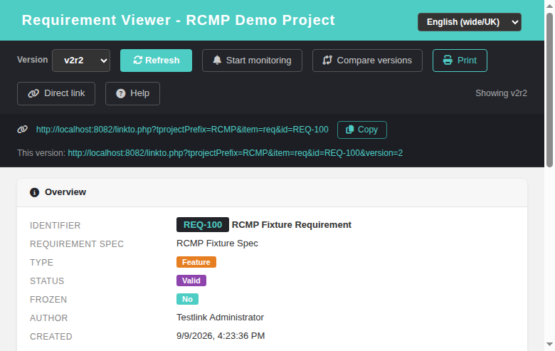
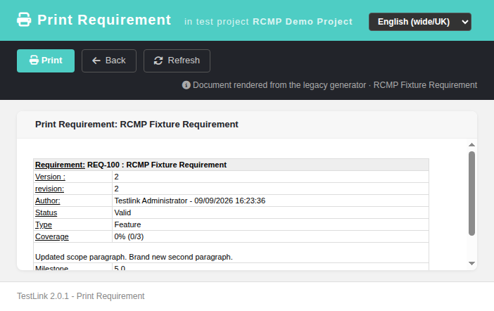
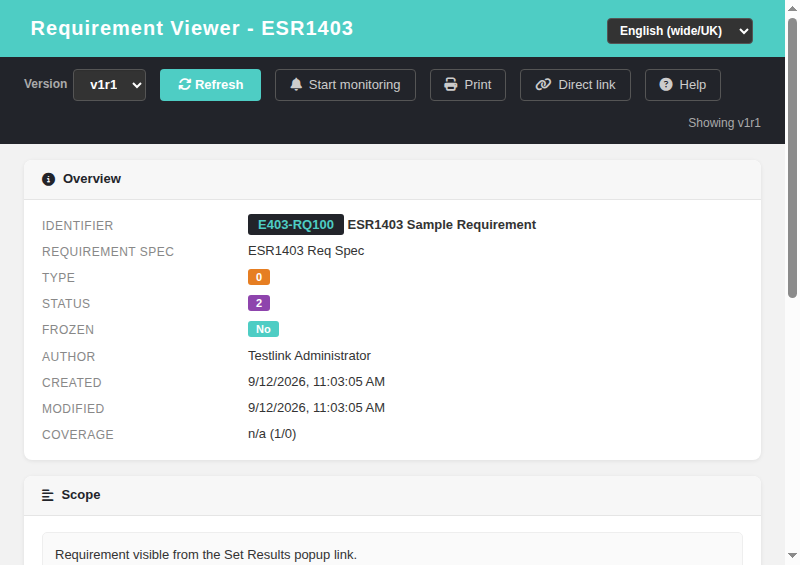

# Requirement Viewer (reqView)

Modernized screen: **Requirement Viewer** (opened from Requirement Overview,
Requirement Monitoring Overview and Search Requirements). Refs
[#755](https://github.com/sebiboga/testlink-upgraded/issues/755).

## What it does

Read-only detail view of a single requirement — the Dashio rewrite of the
legacy popup `lib/requirements/reqView.php`, backed by a new JSON BFF action
`GET /api/requirements/view`. Nothing from the legacy screen was dropped:

| Section | Content |
|---|---|
| Toolbar | version selector (`vN rM`, closed versions tagged `*`), refresh, monitoring toggle, **Print**, **Direct link** (toggle), **Help** |
| Print | opens the new print screen `printReq.html` in a resizable popup |
| Direct link | shows the requirement permalink (`linkto.php?tprojectPrefix=<T>&item=req&id=<docID>`) plus a version-specific link and a **Copy** button (clipboard API with `execCommand` fallback; teal toast on success) |
| Help | links to the GitHub wiki Requirement-Viewer page |
| Overview | identifier (`docID`), requirement title, requirement spec path, type, status, frozen, author, created / modified, coverage `pct% (covered/expected)` |
| Scope | approval-scope note text (legacy *"approval scope"* field) |
| Custom fields | values of requirement-level custom fields (dates localized by the BFF) |
| Linked Test Cases | DataTables grid: TC external id, test case name (opens the modern `tcView.html`), TC version |
| Relations | DataTables grid: relation, target requirement (`docID : title`, clickable), project, status |
| Monitors | DataTables grid: user login of every user monitoring the requirement (gated on `monitor_requirement` right; shows empty-state message when no monitors) |

Deleted requirements show a "This requirement no longer exists" banner and
an empty version selector; the permission-denied path shows
"Failed to load requirement: No permission".

## Version selector & monitor

- The selector lists every version of the requirement (newest first); a
  trailing `*` marks closed (frozen) versions. Switching versions reloads the
  whole view for that version.
- **Start/Stop monitoring** hits the existing `POST /api/requirements/monitor`
  action (`{reqId, action:'on'|'off'}`). Monitoring is per **requirement**
  (legacy parity), so the state survives version switches.
- The **Print** toolbar button opens
  `gui/templates/requirements/printReq.html?req_id&req_version_id&req_revision&tproject_id`
  in a popup. The print screen mirrors `tcPrint.html`: it calls
  `GET /api/requirements/index.php?action=req_print` and embeds the legacy
  generator output (`lib/requirements/reqPrint.php`) in a sandboxed iframe
  (Print / Back / Refresh toolbar, inline-anchor navigation, localized error
  banner on failure). The BFF resolves the requested revision (falling back to
  the version's stored revision) — without it the legacy generator crashed with
  a DB error.
- The **Direct link** toggle shows the requirement permalink
  (`basehref` + `linkto.php?tprojectPrefix=<code>&item=req&id=<docID>`,
  legacy `reqView.php` formula) and re-renders the version-specific link when
  the version selector changes.

## Access & permission

* Deep links switched from `lib/requirements/reqView.php` to
  `gui/templates/requirements/reqView.html` in the three modern screens:
  `reqOverview.html` (`openReq`), `reqMonitorOverview.html` (`openReq`),
  `searchReq.html` (`openReq`/`openReqVersion`; the legacy revision popup is
  mapped to the version viewer).
* **Set Results popup** (`execSetResults.html` `openReqWindow()`, Refs #1477):
  the last legacy screen reference left in the modern UI. The linked
  requirements list ("LINKED REQUIREMENTS" section) now opens
  `gui/templates/requirements/reqView.html?id=..&tproject_id=..` instead of
  `/lib/requirements/reqView.php?showReqSpecTitle=1&requirement_id=..`. The
  legacy `showReqSpecTitle=1` flag is obsolete — the modern viewer always
  renders the requirement spec path (`r.spec_path`) in the Overview card.
* Required right: `mgt_view_req`. The BFF resolves the requirement's own
  test project through a direct JOIN (`requirements` → `req_specs`) instead of
  `requirement_mgr::getTestProjectID()` (that helper throws a DB error on
  missing ids). Without the right the API answers HTTP 403 and the screen shows
  "No permission".

## i18n

29 new keys (`reqv.*`) plus 18 more (`reqv.print`, `reqv.directLink`,
`reqv.help`, `reqv.helpTooltip`, `reqv.copyLink`, `reqv.specificLink`,
`reqv.directLinkCopied` and the `reqprint.*` block) added to **all** locale
bundles: en, de, es, fr, it, ja, pt, ro, ru, zh.

## BFF

`GET /api/requirements/index.php/view?id=N[&version_id=M]`

Returns the requirement (current or requested version), spec path, type/status
labels, coverage data, custom-field values, monitor state for the caller,
relations, the full version list for the selector, the caller's grants
(`req_mgmt`, `monitor_req`, `req_tcase_link_management`), and the **`direct_link`**
permalink. Unknown ids return `req_deleted:true`.

`GET /api/requirements/index.php?action=req_print&req_id&req_version_id&req_revision&tproject_id`

Renders the single requirement via the legacy `reqPrint.php` into
`{status, req_id, req_version_id, req_revision, tproject_id, tproject_name,
reqname, title, body_html}`. Checks `mgt_view_req` (HTTP 403 on missing right).

## Bugs found while testing

* #765 — legacy `requirement_mgr::getTestProjectID()` +
  `requirement_spec_mgr::get_last_child_info()` emit DB-SQL-error /
  null-array warnings when creating requirements on a first-level spec
  (surfaced while seeding fixtures; the modern viewer does not use this path).

## Test evidence

Suite 764 in `tmp/TLU_Test_Cases.md` — 17/17 PASS (BFF routes, version switch,
monitor on/off + DB rows, deleted banner, 403 permission path, relations grid,
deep-link regression). Suite 1305 — Print / Direct link / Help (see below).

