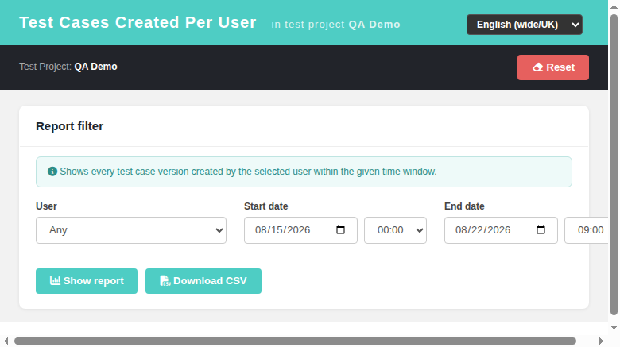
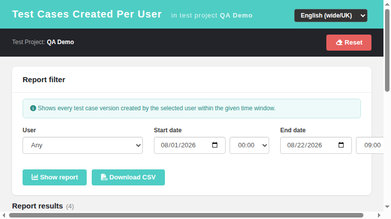

# Test Cases Created Per User (modernized screen)

Modernized the **Test Cases Created Per User** report — previously the legacy
`lib/results/tcCreatedPerUserOnTestProject.php` (Smarty + ExtJS grid) linked
from the ASIDE menu under *Test Case Design*.

## What was built

- **REST BFF API `api/results/index.php`** (plain PHP, session auth, JSON I/O),
  mirroring the legacy controller 1:1:
  - `GET /meta` → rights (`testplan_metrics`, same as legacy `checkRights()`),
    project info, user drop-down (`getUsersForHtmlOptions()` +
    `ALL_USERS_FILTER`), default window from `reportsCfg`
    (`start_date_offset` / `start_time`);
  - `GET /report` → rows from `testproject::getTestCasesCreatedByUser()`;
    `user_id=0` = *Any user* (legacy `TL_USER_ANYBODY`); time window
    `[startDate HH:00:00, endDate HH:59:59]`; invalid dates drop the filter
    (legacy `sanitizeDates()` semantics);
  - `GET /csv` → same result set with the legacy CSV column layout
    (User / Test Suite / Test Case / Importance "(N) Label" / Created /
    Last modified / Start Time / End Time), UTF-8 BOM.
- **Dashio screen `gui/templates/results/tcCreatedPerUserOnTestProject.html`**:
  teal header + project context, filter panel (user select, start/end date +
  hour selects), DataTables results table grouped/sorted by user then suite,
  importance badges (low/medium/high), TC links and pen icon opening the Test
  Case Viewer popup, CSV blob download, Reset button, stats footer
  ("Generated on … · N rows, N users, N test cases"), localized empty state,
  rights warning box when `testplan_metrics` is missing.
- **i18n**: 26 new `tcPerUser.*` keys in ALL 10 locale bundles
  (en, ro, de, es, fr, it, pt, ru, ja, zh) + `common.reset`.
- **ASIDE link switched**: `$actions->tcCreatedUser` in
  `lib/functions/common.php` now points to the new HTML screen; the legacy PHP
  page stays untouched for the tl-classic theme.

## Screenshots

- Filter panel with defaults: 
- Report results: 

## Testing

16-step browser/API suite recorded as Suite 41 in `tmp/TLU_Test_Cases.md`:
defaults, empty state, full report, per-user filter, hour-boundary semantics,
TC viewer links, CSV content, reset, RO localization, 401 path, i18n parity,
aside link. All PASS.

Two bugs were found and fixed while testing:

1. BFF `/meta` returned HTTP 500 — missing `require_once('users.inc.php')`.
2. The parallel CI factory clobbered the shared locale bundles and reverted
   the aside link twice; both times re-restored (see git history:
   "restore tcPerUser keys + aside link").

Fixture note: a first SQL fixture forgot the `nodes_hierarchy` rows for the
tcversion nodes (`node_type_id=4`), which made the report silently empty —
data issue, not a product bug.

Event Viewer after testing: no new Error/Warning entries from the screen or
BFF (only audit login + warnings from my own CLI diagnostics).
