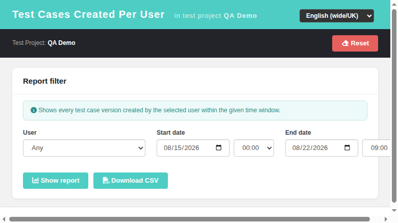
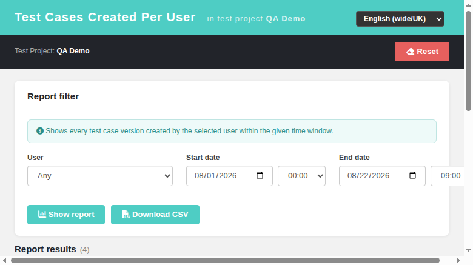

# Test Cases Created Per User (modernized screen)

Modernized the **Test Cases Created Per User** report — previously the legacy
`lib/results/tcCreatedPerUserOnTestProject.php` (Smarty + ExtJS grid) linked
from the ASIDE menu under *Test Case Design*.

## What was built

- **REST BFF API `api/results/index.php`** (plain PHP, session auth, JSON I/O),
  mirroring the legacy controller 1:1:
  - `GET /meta` → rights (`testplan_metrics`, same as legacy `checkRights()`),
    project info, user drop-down (`getUsersForHtmlOptions()` +
    `ALL_USERS_FILTER`), default window from `reportsCfg`
    (`start_date_offset` / `start_time`);
  - `GET /report` → rows from `testproject::getTestCasesCreatedByUser()`;
    `user_id=0` = *Any user* (legacy `TL_USER_ANYBODY`); time window
    `[startDate HH:00:00, endDate HH:59:59]`; invalid dates drop the filter
    (legacy `sanitizeDates()` semantics);
  - `GET /csv` → same result set with the legacy CSV column layout
    (User / Test Suite / Test Case / Importance "(N) Label" / Created /
    Last modified / Start Time / End Time), UTF-8 BOM.
- **Dashio screen `gui/templates/results/tcCreatedPerUserOnTestProject.html`**:
  teal header + project context, filter panel (user select, start/end date +
  hour selects), DataTables results table grouped/sorted by user then suite,
  importance badges (low/medium/high), TC links and pen icon opening the Test
  Case Viewer popup, CSV blob download, Reset button, stats footer
  ("Generated on … · N rows, N users, N test cases"), localized empty state,
  rights warning box when `testplan_metrics` is missing.
- **i18n**: 26 new `tcPerUser.*` keys in ALL 10 locale bundles
  (en, ro, de, es, fr, it, pt, ru, ja, zh) + `common.reset`.
- **ASIDE link switched**: `$actions->tcCreatedUser` in
  `lib/functions/common.php` now points to the new HTML screen; the legacy PHP
  page stays untouched for the tl-classic theme.

## Screenshots

- Filter panel with defaults: 
- Report results: 

## Testing

16-step browser/API suite recorded as Suite 41 in `tmp/TLU_Test_Cases.md`:
defaults, empty state, full report, per-user filter, hour-boundary semantics,
TC viewer links, CSV content, reset, RO localization, 401 path, i18n parity,
aside link. All PASS.

Two bugs were found and fixed while testing:

1. BFF `/meta` returned HTTP 500 — missing `require_once('users.inc.php')`.
2. The parallel CI factory clobbered the shared locale bundles and reverted
   the aside link twice; both times re-restored (see git history:
   "restore tcPerUser keys + aside link").

Fixture note: a first SQL fixture forgot the `nodes_hierarchy` rows for the
tcversion nodes (`node_type_id=4`), which made the report silently empty —
data issue, not a product bug.

Event Viewer after testing: no new Error/Warning entries from the screen or
BFF (only audit login + warnings from my own CLI diagnostics).

## Group-by-user grid + ExtGrid toolbar (Issue #1111)

The legacy `tlExtTable` (`lib/results/tcCreatedPerUserOnTestProject.php:162-191`)
rendered the result set **grouped by the author's login** (the first ghost
column carried `login` and was passed to `setGroupByColumnName()` at `:178`),
with the grouped User column hidden (`hideGroupedColumn=true`,
`exttable.class.php:55`) and an ExtGrid toolbar offering *Expand/Collapse
Groups* (`:182`), *Show all Columns* (`:183`), *Reset Filters*
(`exttable.class.php:124`, `inc_ext_table.tpl:292-300`) and the *MultiSort*
affordance (`allowMultiSort=true`, `exttable.class.php:43`). Default order was
Test Suite **DESC** (`:188-189`). The first 2.0.1 port flattened all of this
into one plain DataTable — the grouping and toolbar were dropped.

Now restored in `gui/templates/results/tcCreatedPerUserOnTestProject.html`:

- DataTables **RowGroup 1.4.1** groups rows by `login` into collapsible
  `<login> (N Items)` headers; the grouped User column starts hidden and is the
  **primary sort criterion** (a `pinGroupOrder()` guard keeps each user in one
  contiguous group), with the legacy secondary **Test Suite DESC** order.
- Grid toolbar with the four legacy buttons: **Expand/Collapse Groups**,
  **Show all Columns** (toggles the hidden User column), **Reset Filters**
  (clears the search and restores the default order), **MultiSort** hint
  (`orderMulti:true`).
- A plain-`<tbody>` fallback renders the same group headers if the
  DataTables/RowGroup CDN is unavailable, so rows are never lost.
- i18n: 12 new `tcPerUser.grid.*` keys across all 10 locale bundles.

No BFF change was required — `api/results/index.php` `runReport()` already
returns the full sorted row set including `login`.

### Bug fixed while verifying (#1111)

`resetFilters()` chained `order()` off the **Columns API**
(`resTbl.search('').columns().search('').order([...]).draw()`).
`columns().order()` assigns a per-column order, so after a Reset the group
order flipped to descending user and the DataTables order structure became one
bogus per-column entry per column. Fixed by clearing the searches on the
Columns API and setting the table order on the **table** API
(`tcCreatedPerUserOnTestProject.html:581-590`).

### Testing

13-step browser/API suite recorded as `Task — Issue #1111` in
`tmp/TLU_Test_Cases.md`: grouping, collapse/expand (all + single group),
show-all-columns, reset filters, multsort, user filter, empty state, CSV,
console, syntax, i18n coverage, Event Viewer. All PASS.
