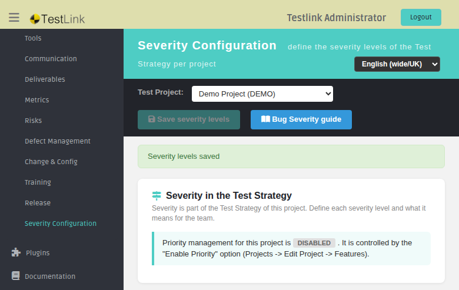
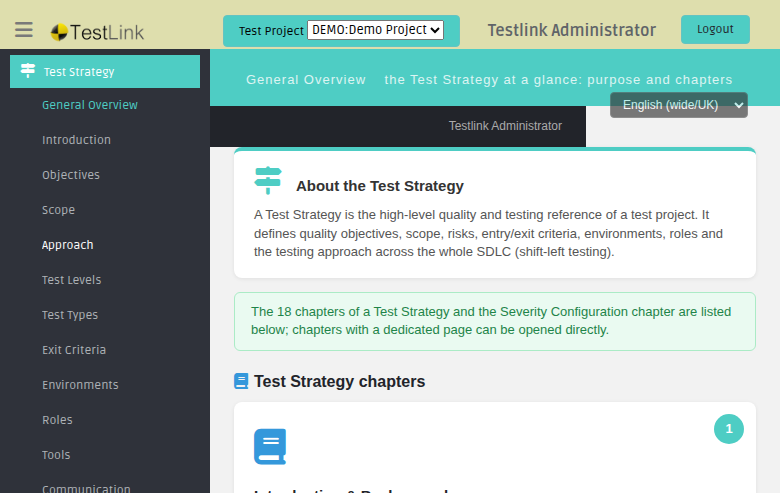
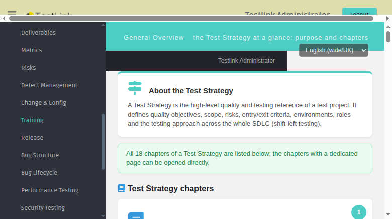
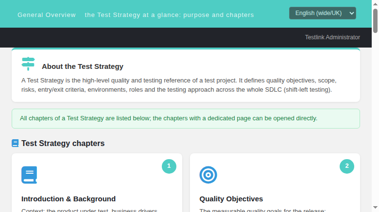
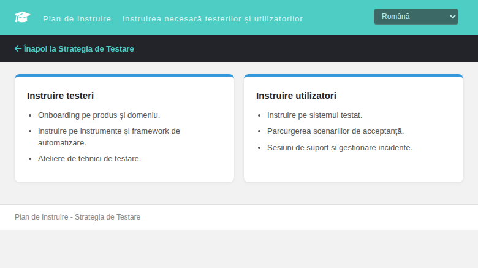

# Test Strategy — General Overview (Modernized)

Refs: issue #1431 · issue #1426 · issue #1425 · issue #1423

## What this screen does

The **Test Strategy General Overview** is a Dashio screen that provides
a hub/map of the standard ISTQB-style chapters that make up a Test Strategy
document — currently 28 (18 standard + Severity Configuration + Bug Structure +
Bug Lifecycle + the 7 NFR type chapters).
It lives in the ASIDE under "Test Strategy" and is the landing page for the
entire Test Strategy section.

The screen is BFF-backed (`api/strategy/index.php`) and all content is served
via `TLi18n` keys — zero hardcoded text.

## Where the files live

| Component | Path |
|---|---|
| Dashio screen | `gui/templates/strategy/testStrategy.html` |
| Scope sub-page | `gui/templates/strategy/scope.html` |
| Exit Criteria sub-page | `gui/templates/strategy/exitCriteria.html` |
| Bug Structure sub-page | `gui/templates/strategy/bugStructure.html` (Refs #1289) |
| Bug Lifecycle sub-page | `gui/templates/strategy/bugLifecycle.html` (Refs #1290) |
| NFR chapter sub-pages | `gui/templates/strategy/nfr{Performance,Security,Usability,Accessibility,Compatibility,Reliability,Maintainability}.html` (Refs #1052, #1462) |
| Severity Configuration | `gui/templates/projects/severityConfig.html` (Refs #1294) |
| BFF API | `api/strategy/index.php` |
| NFR Requirements screen (Requirements ASIDE) | `gui/templates/requirements/nfrRequirements.html` + `api/nfr/index.php` (Refs #1052, #1462) |
| i18n keys | `gui/templates/i18n/*.json` (`ts.chapter*` key pairs per chapter + screen keys; 14 `ts.chapter{Type}*` keys for chapters 22–28) |
| ASIDE links | `lib/functions/common.php` → `$actions->testStrategy*` + `$actions->nfrRequirements` |
| ASIDE menu | `gui/templates/dashio/aside.tpl` (Test Strategy submenu + Requirements → NFR Requirements) |

## The 28 chapter cards

Each card renders:

- a **number badge** (1–28) in the teal circle;
- a chapter **icon** and **title**;
- a short chapter **description**;
- an **Open chapter** button **only** when a dedicated page exists.

| # | Chapter | Dedicated page |
|---|---|---|
| 1 | Introduction & Background | — |
| 2 | Quality Objectives | — |
| 3 | Scope | `gui/templates/strategy/scope.html` |
| 4 | Test Approach | — |
| 5 | Test Levels | — |
| 6 | Test Types | — |
| 7 | Entry & Exit Criteria | `gui/templates/strategy/exitCriteria.html` |
| 8 | Test Environments | — |
| 9 | Roles & Responsibilities | — |
| 10 | Testing Tools & Automation | — |
| 11 | Communication & Status Reporting | — |
| 12 | Test Deliverables | — |
| 13 | Metrics & Measurements | — |
| 14 | Risks & Mitigation | — |
| 15 | Defect Management | — |
| 16 | Change & Configuration Management | — |
| 17 | Training Plan | `gui/templates/strategy/training.html` (Refs #1456) |
| 18 | Release Information | — |
| 19 | Severity Configuration | `gui/templates/projects/severityConfig.html` |
| 20 | Bug Structure | `gui/templates/strategy/bugStructure.html` |
| 21 | Bug Lifecycle | `gui/templates/strategy/bugLifecycle.html` |
| 22 | Non-Functional: Performance | `gui/templates/strategy/nfrPerformance.html` |
| 23 | Non-Functional: Security | `gui/templates/strategy/nfrSecurity.html` |
| 24 | Non-Functional: Usability | `gui/templates/strategy/nfrUsability.html` |
| 25 | Non-Functional: Accessibility | `gui/templates/strategy/nfrAccessibility.html` |
| 26 | Non-Functional: Compatibility | `gui/templates/strategy/nfrCompatibility.html` |
| 27 | Non-Functional: Reliability | `gui/templates/strategy/nfrReliability.html` |
| 28 | Non-Functional: Maintainability | `gui/templates/strategy/nfrMaintainability.html` |

Total: **28 cards**. Chapters without a dedicated page render no action button (by
design — the card is the entry point for future chapter pages).

## BFF API — api/strategy/index.php

| Route | Auth | Response |
|---|---|---|
| `GET ?action=chapters` | Session required (401 anonymous) | `{ status:'ok', chapters: [...], footer: {...}, grants:{strategy_read:true} }` |
| `GET ?action=info` | Session required | `{ status:'ok', footer: {...}, grants:{strategy_read:true} }` |

**`chapters` response** — the `chapters` array contains 28 entries (18 ISTQB
chapters + Severity Configuration + Bug Structure + Bug Lifecycle + the 7 NFR
type chapters). Each entry has:
- `num` — chapter number (1–28)
- `icon` — FontAwesome icon class (e.g. `fa-book`)
- `key` — TLi18n title key (e.g. `ts.chapterIntro`)
- `descKey` — TLi18n description key (e.g. `ts.chapterIntroDesc`)
- `url` — path to a dedicated sub-page (`null` if no sub-page exists)

**`footer`** includes `login`, `displayName`, `generated_on` (server
timestamp), and `right.mgt_modify_product`.

**Error paths** — 401 (anonymous/not-authenticated), 403 (POST without
same-origin CSRF guard), 400 (`Unknown action`).

## ASIDE link routing

The **ASIDE "Test Strategy"** submenu items are wired through
`lib/functions/common.php`:

```php
$actions->testStrategy = "/gui/templates/strategy/testStrategy.html?{$ctx}";
$actions->testStrategyScope = "/gui/templates/strategy/scope.html?{$ctx}";
$actions->testStrategyExit = "/gui/templates/strategy/exitCriteria.html?{$ctx}";
// ... bug chapters (testStrategyBugStructure, testStrategyBugLifecycle) and the
// 7 NFR chapters (testStrategyPerformance … testStrategyMaintainability) ...
$actions->nfrRequirements = "/gui/templates/requirements/nfrRequirements.html?{$ctx}";
```

`gui/templates/dashio/aside.tpl` uses `{$gui->uri->testStrategy}`,
`{$gui->uri->testStrategyScope}`, `{$gui->uri->testStrategyExit}` and the
corresponding `{$gui->uri->testStrategy*}` / `{$gui->uri->nfrRequirements}`
tokens for the newer items.

## i18n coverage

The `ts.*` namespace covers all content screens (overview, scope, exit criteria,
bug chapters, NFR chapters); the NFR type slugs share the `nfr.types.*` labels
used by the NFR Requirements screen. All bundles are valid JSON
(`python3 -m json.tool`) and carry the same key sets: 10 bundles, each with
`ts.chapter<X>`/`ts.chapter<X>Desc` key pairs for all 28 chapters plus the 70
`ts.nfr{Type}*` chapter-content keys and 40 `nfr.*` NFR Requirements screen keys.

**Issue #1431** added the initial keys as English copies in all 10 bundles.
**Issue #1426** upgraded the 8 non-en/ro bundles with **real native translations**
(de/es/fr/it/ja/pt/ru/zh) and added `ts.generatedOn` / `ts.errLoad` across all
8 translated bundles.

## Screenshots


## Regression test suites

See `tmp/TLU_Test_Cases.md`:
- Test Suite 1431 (10/10 PASS) — BFF API, ASIDE routing, card rendering, locale switch
- Test Suite 1426 (6/6 PASS) — card order/count, open-chapter buttons, locale switch (de + ru, zero literal keys), all-bundle i18n coverage, aside menu integration, Event Viewer clean

## Bugfix — Issue #1458 (chapter counter note + aside icon)

**Symptom:** commit `f934433d7` added the 19th chapter (Severity Configuration)
to the BFF chapter map, so the grid renders **19** cards, but two leftovers
remained inconsistent:

1. The overview info note (`ts.navAdded3`) still read *"All 18 chapters of a Test
   Strategy are listed below…"* in **all 10** locale bundles.
2. The ASIDE sub-menu item for "Severity Configuration" kept the Risks chapter's
   `fa-exclamation-triangle` icon instead of the chapter's own `fa-sliders-h`.

**Root cause:** `ts.navAdded3` sat at `en.json:3010` / `ro.json:3010` (and
`*:3220` in the other 8 bundles) — the same stale sentence carried by all
bundles from before chapter 19 existed. The aside icon was copied together with
the *Risks & Mitigation* sub-item block in `aside.tpl:159` and never updated to
the chapter icon `fa-sliders-h` (the one used by the BFF `api/strategy` chapter
19 entry and the General Overview card 19).

**Fix commit:** `dcdc97105` (branch `fix/issue-1458`, `Fixes #1458`):
- `ts.navAdded3` now reads *"The 18 chapters of a Test Strategy and the Severity
  Configuration chapter are listed below; chapters with a dedicated page can be
  opened directly."* (native equivalents in ro and the other 8 bundles; 1-line
  change per file, all `python3 -m json.tool`-valid).
- `aside.tpl:159` icon: `fas fa-exclamation-triangle` → `fas fa-sliders-h`.

Note on the aside icon: `asideMenu.php`/`asideFrame.tpl` JS rewraps each sub-item
link with a `<span class="menu-label">` at runtime, which strips `<i>` icons in
the rendered sub-menu — so the fix aligns the **source** template with the
chapter icon (visual consistency is enforced elsewhere via the chapter card and
BFF payload); this is documented, not hidden.

**Regression:** new suite `Regression — Issue #1458` in `tmp/TLU_Test_Cases.md`
(10/10 PASS): note text EN + RO, card count = 19, all 10 bundles valid, aside
source icon, chapter 19 opens from aside + overview card (EN + RO), severity
save regression, `events` table clean, browser console clean.

Screenshots:



## Bugfix — Issue #1456 (Training Plan chapter verified + General Overview note regression)

**Scope.** #1456 is the tracking issue for the *Test Strategy chapter: Training
Plan*. The chapter implementation (`gui/templates/strategy/training.html`,
icon `fa-graduation-cap`, ASIDE sub-menu **Training** `aside.tpl:157`, card 17
"Training Plan" with *Open chapter* in the General Overview, `ts.training*`
i18n keys in all 10 bundles) already landed on the default branch
(`f934433d7` + `1ee2e0501` + `945679c5b`) and was re-verified end-to-end in
this run (8/8 PASS — see `tmp/TLU_Test_Cases.md`).

**Defect found while verifying → a regression of the #1458 fix.** The General
Overview info note (`ts.navAdded3`) claimed *"All 18 chapters of a Test
Strategy are listed below…"* while the same page renders **28** chapter cards:

- **EN + RO** bundles had been reverted by `5888975934`
  (`feat(strategy): add Bug Structure and Bug Lifecycle chapters`) from the
  #1458 recount ("18 + Severity Configuration") back to the *original* "All 18
  chapters…" wording — even though that same commit appended chapters 20–21
  to the BFF map (and `8c28f47af` later appended chapters 22–28).
- The **other 8 bundles** still carried the *old intermediate* #1458 text
  ("The 18 chapters … and the Severity Configuration chapter …").
- The static pre-i18n fallback `testStrategy.html:63` also said "18".

**Root cause.** Any hardcoded chapter count in a user-facing note is brittle:
every chapter addition silently desynchronizes the note from the grid (this is
the second time it went stale). The fix therefore makes `ts.navAdded3`
**count-free**.

**Fix (branch `fix/issue-1456-training-chapter`):**
- `ts.navAdded3` in **all 10** locale bundles now reads *"All chapters of a
  Test Strategy are listed below; the chapters with a dedicated page can be
  opened directly."* (native equivalents in de/es/fr/it/ja/pt/ro/ru/zh;
  1-line change per file, all `python3 -m json.tool`-valid).
- `gui/templates/strategy/testStrategy.html:63` fallback updated to the same
  wording.

**Regression:** suite `Regression — Issue #1456` in `tmp/TLU_Test_Cases.md`
(**8/8 PASS**): chapter page EN/RO, ASIDE wiring + icon, overview card 17,
note text EN/RO count-free, 28 cards + BFF 28 entries, all 10 bundles valid,
`events` table clean, browser console clean.

Screenshots:



