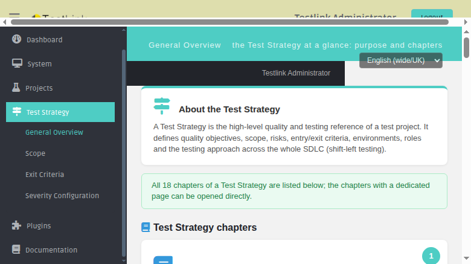
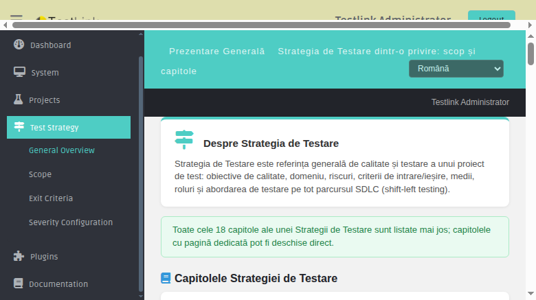
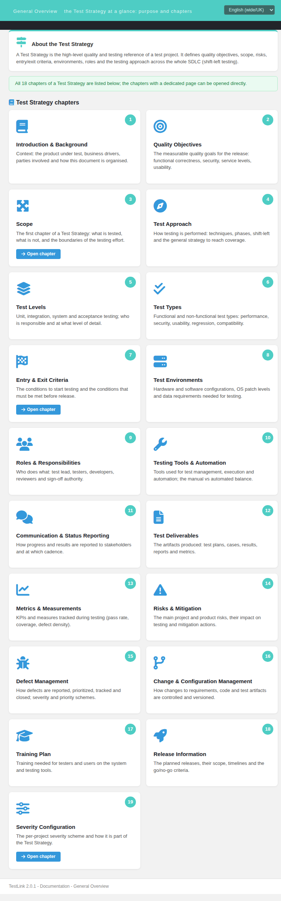
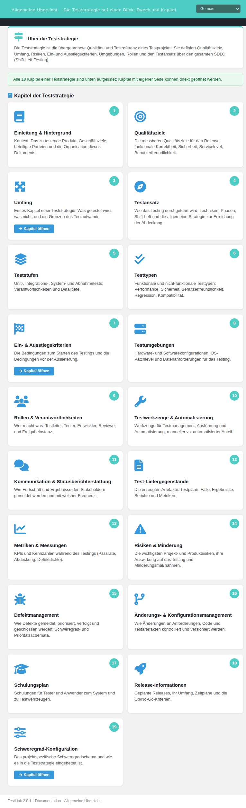

# Test Strategy — General Overview (Modernized)

Refs: issue #1431 · issue #1426 · issue #1425 · issue #1423

## What this screen does

The **Test Strategy General Overview** is a Dashio screen that provides
a hub/map of the 18 ISTQB-style chapters that make up a Test Strategy document.
It lives in the ASIDE under "Test Strategy" and is the landing page for the
entire Test Strategy section.

The screen is BFF-backed (`api/strategy/index.php`) and all content is served
via `TLi18n` keys — zero hardcoded text.

## Where the files live

| Component | Path |
|---|---|
| Dashio screen | `gui/templates/strategy/testStrategy.html` |
| Scope sub-page | `gui/templates/strategy/scope.html` |
| Exit Criteria sub-page | `gui/templates/strategy/exitCriteria.html` |
| Severity Configuration | `gui/templates/projects/severityConfig.html` (Refs #1294) |
| BFF API | `api/strategy/index.php` |
| i18n keys | `gui/templates/i18n/*.json` (79 keys under `ts.*`) |
| ASIDE links | `lib/functions/common.php` → `$actions->testStrategy*` |
| ASIDE menu | `gui/templates/dashio/aside.tpl` (Test Strategy submenu) |

## The 19 chapter cards

Each card renders:

- a **number badge** (1–19) in the teal circle;
- a chapter **icon** and **title**;
- a short chapter **description**;
- an **Open chapter** button **only** when a dedicated page exists.

| # | Chapter | Dedicated page |
|---|---|---|
| 1 | Introduction & Background | — |
| 2 | Quality Objectives | — |
| 3 | Scope | `gui/templates/strategy/scope.html` |
| 4 | Test Approach | — |
| 5 | Test Levels | — |
| 6 | Test Types | — |
| 7 | Entry & Exit Criteria | `gui/templates/strategy/exitCriteria.html` |
| 8 | Test Environments | — |
| 9 | Roles & Responsibilities | — |
| 10 | Testing Tools & Automation | — |
| 11 | Communication & Status Reporting | — |
| 12 | Test Deliverables | — |
| 13 | Metrics & Measurements | — |
| 14 | Risks & Mitigation | — |
| 15 | Defect Management | — |
| 16 | Change & Configuration Management | — |
| 17 | Training Plan | — |
| 18 | Release Information | — |
| 19 | Severity Configuration | `gui/templates/projects/severityConfig.html` |

Total: **19 cards**. Chapters without a dedicated page render no action button (by
design — the card is the entry point for future chapter pages).

## BFF API — api/strategy/index.php

| Route | Auth | Response |
|---|---|---|
| `GET ?action=chapters` | Session required (401 anonymous) | `{ status:'ok', chapters: [...], footer: {...}, grants:{strategy_read:true} }` |
| `GET ?action=info` | Session required | `{ status:'ok', footer: {...}, grants:{strategy_read:true} }` |

**`chapters` response** — the `chapters` array contains 19 entries (18 ISTQB
chapters + 19: Severity Configuration). Each entry has:
- `num` — chapter number (1–19)
- `icon` — FontAwesome icon class (e.g. `fa-book`)
- `key` — TLi18n title key (e.g. `ts.chapterIntro`)
- `descKey` — TLi18n description key (e.g. `ts.chapterIntroDesc`)
- `url` — path to a dedicated sub-page (`null` if no sub-page exists)

**`footer`** includes `login`, `displayName`, `generated_on` (server
timestamp), and `right.mgt_modify_product`.

**Error paths** — 401 (anonymous/not-authenticated), 403 (POST without
same-origin CSRF guard), 400 (`Unknown action`).

## ASIDE link routing

The ASIDE "Test Strategy" submenu items are wired through
`lib/functions/common.php`:

```php
$actions->testStrategy = "/gui/templates/strategy/testStrategy.html?{$ctx}";
$actions->testStrategyScope = "/gui/templates/strategy/scope.html?{$ctx}";
$actions->testStrategyExit = "/gui/templates/strategy/exitCriteria.html?{$ctx}";
```

`gui/templates/dashio/aside.tpl` uses `{$gui->uri->testStrategy}`,
`{$gui->uri->testStrategyScope}`, `{$gui->uri->testStrategyExit}`.

## i18n coverage

All 79 `ts.*` keys are present in every locale bundle (en/ro/de/es/fr/it/ja/pt/ru/zh)
and were validated via `python3 -m json.tool` before commit. The `ts.*` namespace
covers all three content screens (overview, scope, exit criteria).

**Issue #1431** added the initial keys as English copies in all 10 bundles.
**Issue #1426** upgraded the 8 non-en/ro bundles with **real native translations**
(de/es/fr/it/ja/pt/ru/zh) and added `ts.generatedOn` / `ts.errLoad` across all
8 translated bundles.

## Screenshots






## Regression test suites

See `tmp/TLU_Test_Cases.md`:
- Test Suite 1431 (10/10 PASS) — BFF API, ASIDE routing, card rendering, locale switch
- Test Suite 1426 (6/6 PASS) — card order/count, open-chapter buttons, locale switch (de + ru, zero literal keys), all-bundle i18n coverage, aside menu integration, Event Viewer clean
