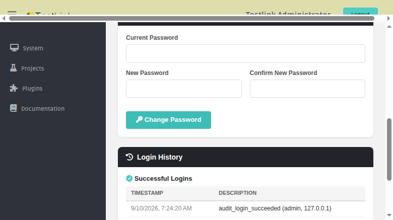
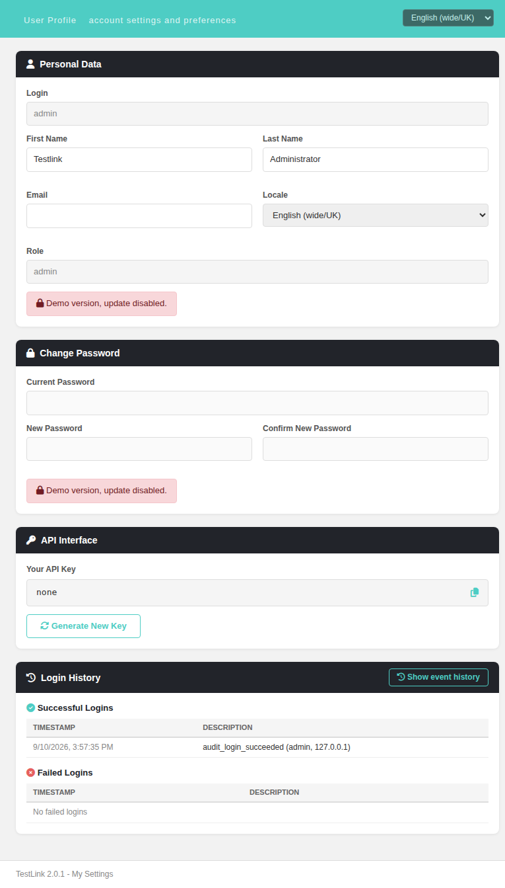

# TestLink User Profile — Wiki

The User Profile screen (`My Settings`) lets the logged-in user review and edit
their personal data, change their password, manage their API interface key and
inspect their login history.

**Path:** Top navigation bar > user name > `My Settings`
**URL:** `gui/templates/usermanagement/userInfo.html`
**BFF API:** `api/userinfo/index.php`

---

## Cards on the screen

| Card | Description |
|------|-------------|
| **Personal Data** | Login (read-only), First name, Last name, Email, Locale, Role (read-only), and a **Save** button. **Save hidden, replaced by a demo notice when `$tlCfg->demoMode = ON`** (see below). |
| **Change Password** | Old / New / Confirm password fields and a **Change Password** button. **Hidden, replaced by an informational note when password management is external** (see below), and by the same demo notice in demo mode. |
| **API Interface** | Read-only display of the current API key plus a **Generate New Key** button. **Only rendered when the XML-RPC API is enabled** (`$tlCfg->api->enabled = TRUE`, see below). |
| **Login History** | Last 10 successful and failed logins (timestamp + description). Header shows a right-gated **Show event history** button (see below). |

---

## External password management

When the user's authentication domain has `allowPasswordManagement = false`
(e.g. an LDAP domain), password changes are **not managed by TestLink**:

- Legacy behaviour (1.9.20, `lib/usermanagement/userInfo.php` +
  `gui/templates/dashio/usermanagement/userInfo.tpl:177-204`): the Change
  Password form is hidden and replaced by the localized message
  `your_password_is_external`.
- Modern behaviour (2.0.1): the same — `tlUser::isPasswordMgtExternal()` is
  evaluated server-side and exposed as `isPasswordExternal` in the
  `GET /api/userinfo` payload. The front-end then hides the form and shows the
  note **"Your password is managed by an external system."**
- The BFF also rejects `PUT /api/userinfo/password` with **HTTP 403** when
  password management is external, so the change can never be performed even by
  a direct API call.

Example (external state):

---

## API interface gating

The **API Interface** card follows the global XML-RPC API switch
`$tlCfg->api->enabled` in `config.inc.php`:

- Legacy behaviour (1.9.20, `gui/templates/dashio/usermanagement/userInfo.tpl:206`):
  the whole API key section (key display + Generate API Key button) is wrapped
  in `{if $tlCfg->api->enabled}...{/if}` — with the API disabled nothing is shown.
- Modern behaviour (2.0.1): the BFF evaluates `$tlCfg->api->enabled` server-side
  and exposes it as `apiEnabled` in the `GET /api/userinfo` payload. The
  front-end keeps the API Interface card hidden until `apiEnabled` is true.
- The BFF also rejects `POST /api/userinfo/apikey` with **HTTP 403**
  ("API interface is disabled by administrator") when the API is disabled, so a
  key can never be generated even by a direct API call.

Example (API disabled — API Interface card is not rendered):

## Show event history (right-gated)

Next to the **Login History** heading the legacy screen
(`gui/templates/dashio/usermanagement/userInfo.tpl:224-228`) showed a clickable
`question.gif` titled `show_event_history` that opened the Event Viewer filtered
to the logged-in user's audit events (`showEventHistoryFor(userID,'users')`),
but only when the user holds the `mgt_view_events` right (flag computed at
`lib/usermanagement/userInfo.php:90`).

Modern 2.0.1 behaviour — same gate, Dashio styling:

- The BFF exposes **`canViewEvents`** in the `GET /api/userinfo` payload, computed
  with the same project-less check as legacy:
  `(bool)$user->hasRight($db, 'mgt_view_events')`.
- The Login History card header shows a **"Show event history"** button (teal
  outline, `fa-clock-rotate-left` icon, i18n `profile.showEventHistory`) rendered
  only when `canViewEvents` is true.
- Clicking it submits the hidden `#eventhistory` GET form
  (`object_id = <userID>`, `object_type = users`) to
  `gui/templates/eventviewer/eventviewer.html`, which opens in a new tab and
  auto-filters to `users #<userID>`.

This mirrors the pattern already used by `plans/planMilestones.html` (#1149),
`platformsView.html`, `projectEdit` (#991), build edit (#1123) and the milestone
screen.

## Demo mode gating (read-only)

When the global flag `$tlCfg->demoMode = ON` in `config.inc.php` is set, the
screen becomes read-only for the profile and password sections — exactly like
legacy 1.9.20:

- Legacy behaviour (`gui/templates/dashio/usermanagement/userInfo.tpl:165-171`
  and `:193-199`): in demo mode the Save and Change Password **submit buttons
  are not rendered at all**; instead the localized label
  `demo_update_user_disabled` ("Demo mode enabled => Update User DISABLED") is
  shown. The gate applies to ALL users, including admin.
- Modern behaviour (2.0.1): the BFF exposes **`demoMode`** in the
  `GET /api/userinfo` payload (`(bool)config_get('demoMode')`). The front-end
  then hides the Save button and the Change Password button, disables the
  password inputs, and shows the localized notice
  **"Demo version, update disabled."** (i18n `profile.demoUpdateDisabled`) in
  both cards.
- Server-side enforcement: `PUT /api/userinfo` and `PUT /api/userinfo/password`
  are rejected with **HTTP 403** (`messageKey: profile.demoUpdateDisabled`)
  whenever `config_get('demoMode')` is true — so no write can be performed even
  by a direct API call.

Example (demo mode ON — red notices, no Save / Change Password buttons):

## API endpoints

| Method + path | Purpose |
|---|---|
| `GET /api/userinfo` | Profile payload (includes `authentication`, `isPasswordExternal`, `apiEnabled`, `canViewEvents` — the right-gated Event Viewer flag — and `demoMode`) |
| `GET /api/userinfo/locales` | Available locales (single source of truth for all locale dropdowns) |
| `GET /api/userinfo/login-history` | Last 10 successful + failed logins |
| `PUT /api/userinfo` | Update profile (firstName, lastName, email, locale) — **403 in demo mode** |
| `PUT /api/userinfo/password` | Change password (403 when password management is external **or in demo mode**) |
| `POST /api/userinfo/apikey` | Generate a new API key (403 when XML-RPC API is disabled) |