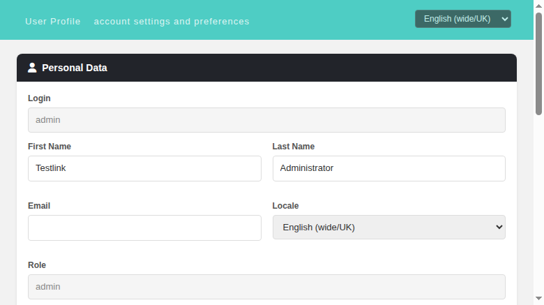

# TestLink User Profile — Wiki

The User Profile screen (`My Settings`) lets the logged-in user review and edit
their personal data, change their password, manage their API interface key and
inspect their login history.

**Path:** Top navigation bar > user name > `My Settings`
**URL:** `gui/templates/usermanagement/userInfo.html`
**BFF API:** `api/userinfo/index.php`

---

## Cards on the screen

| Card | Description |
|------|-------------|
| **Personal Data** | Login (read-only), First name, Last name, Email, Locale, Role (read-only), and a **Save** button. |
| **Change Password** | Old / New / Confirm password fields and a **Change Password** button. **Hidden, replaced by an informational note when password management is external** (see below). |
| **API Interface** | Read-only display of the current API key plus a **Generate New Key** button. |
| **Login History** | Last 10 successful and failed logins (timestamp + description). |

---

## External password management

When the user's authentication domain has `allowPasswordManagement = false`
(e.g. an LDAP domain), password changes are **not managed by TestLink**:

- Legacy behaviour (1.9.20, `lib/usermanagement/userInfo.php` +
  `gui/templates/dashio/usermanagement/userInfo.tpl:177-204`): the Change
  Password form is hidden and replaced by the localized message
  `your_password_is_external`.
- Modern behaviour (2.0.1): the same — `tlUser::isPasswordMgtExternal()` is
  evaluated server-side and exposed as `isPasswordExternal` in the
  `GET /api/userinfo` payload. The front-end then hides the form and shows the
  note **"Your password is managed by an external system."**
- The BFF also rejects `PUT /api/userinfo/password` with **HTTP 403** when
  password management is external, so the change can never be performed even by
  a direct API call.

Example (external state):

---

## API endpoints

| Method + path | Purpose |
|---|---|
| `GET /api/userinfo` | Profile payload (includes `authentication` and `isPasswordExternal`) |
| `GET /api/userinfo/locales` | Available locales (single source of truth for all locale dropdowns) |
| `GET /api/userinfo/login-history` | Last 10 successful + failed logins |
| `PUT /api/userinfo` | Update profile (firstName, lastName, email, locale) |
| `PUT /api/userinfo/password` | Change password (403 when password management is external) |
| `POST /api/userinfo/apikey` | Generate a new API key |