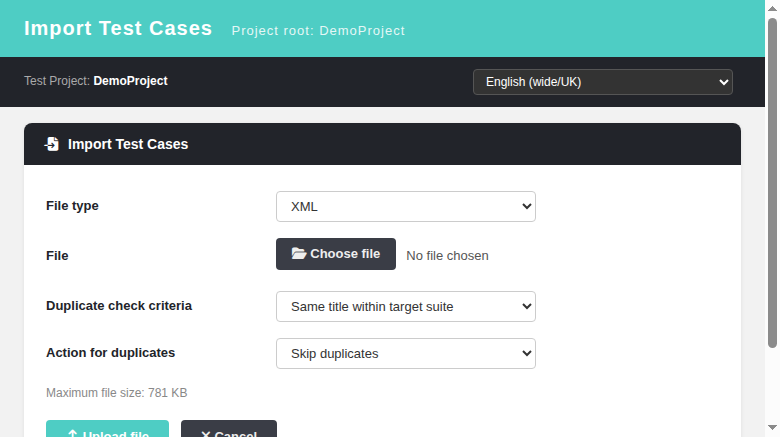

# XML Test Case Import — REST BFF API

**Endpoint:** `POST /api/testcasesimport/?action=import_xml&tproject_id=<id>`
**Auth:** TestLink session (cookie), permission `mgt_modify_tc` on target project
**Import engine:** legacy `lib/testcases/tcImport.php` helpers (function defs extracted + `eval`'d in the BFF)
**Format reference:** TestLink XML export format (`<testcases>` / `<testsuite>` root)

## Request

| Param | Where | Notes |
|---|---|---|
| `tproject_id` | query | target test project (falls back to session project) |
| `containerID` | query | parent suite id; defaults to project root |
| `uploadedFile` | multipart file field | the XML file to import |
| `hit_criteria` | query | `name` (default) \| `internalID` \| `externalID` |
| `action_on_hit` | query | `skip` (default) \| `update_last_version` \| `generate_new` \| `create_new_version` |
| `useRecursion` | query | `1` = import nested `<testsuite>` structure (root must be `<testsuite>`) |
| `intoProject` | query | `1` = import suites under project root |

Limits: file larger than `import_file_max_size_bytes` → HTTP 413; malformed XML → HTTP 422 JSON.

## Semantics
1. The uploaded file is saved to a temp file and validated with a safe parser
   (`libxml_use_internal_errors` + `simplexml_load_string`, `LIBXML_NONET`).
2. Flat import (`testcases`/`testcase` root) → `importTestCasesFromSimpleXML`; the
   recursive import (`testsuite` root, `useRecursion=1`) → `importTestSuitesFromSimpleXML`.
3. Duplicate handling follows `hit_criteria` + `action_on_hit` (legacy parity).
4. Response normalizes the legacy flat `[title, message]` resultMap into a `result`
   array of `{name, message}` rows for a report table.

## Example

```
curl -b cookies.txt -X POST \
  -F "uploadedFile=@sample.xml" \
  "http://host/api/testcasesimport/?action=import_xml&tproject_id=1&containerID=1&hit_criteria=name&action_on_hit=skip"
```

```json
{"status":"ok","tproject":{"id":1,"name":"Demo Project"},"useRecursion":false,
 "intoProject":false,"options":{"hit_criteria":"name","action_on_hit":"skip"},
 "result":[{"name":"Login with valid credentials","message":"ok"},
           {"name":"Logout","message":"ok"}]}
```

## Legacy parity notes (vs `lib/testcases/tcImport.php` `importTestCaseDataFromXML`)
Same permission model, size cap, hit criteria and action set. The legacy page
mixed page-rendering code (config require, Smarty display) with the import
helpers, so the BFF extracts only the pure function definitions (from
`function importTestCaseDataFromXML(` onward) and `eval`'s them — the helper
libs (`common.php`, `xml.inc.php`, `csv.inc.php`) are already loaded by the BFF.

Unlike the legacy page (which `die()`s with raw HTML on malformed XML via
`simplexml_load_file_wrapper()`), the BFF pre-validates and returns a clean
HTTP 422 JSON error.

## Modernized UI (`gui/templates/testcases/tcImport.html`)

The XML import path (`submitLegacyXml` → AJAX `importXml`) posts to the BFF above.
- File type selector: **XML** (BFF `action=import_xml`) vs **Markdown (.md)** (BFF `action=import_md`).
- Duplicate hit criteria (name / internal ID / external ID) + action for duplicates.
- Report table shows per-row title + result message; counts chip for created rows.
- Client-side size guard before upload; server 413 backup; malformed XML → error toast.



## UI regression suite
Suite 819 in `tmp/TLU_Test_Cases.md` (render, XML flat import + DB verify, duplicate
skip on re-import, recursive suite import, malformed XML → 422 toast, MD toggle
regression, Event Viewer cleanliness).
