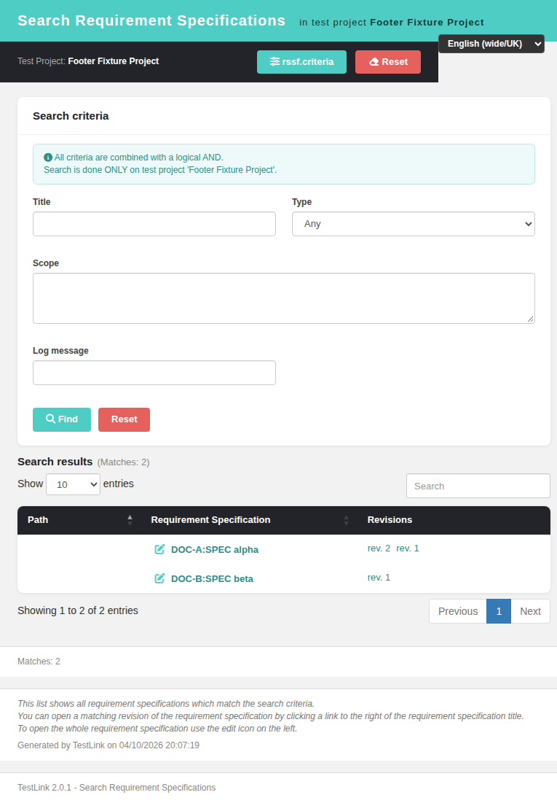

# Issue 1081 — searchReqSpec: "Generated by TestLink on …" results footer restored

The modern **Search Requirement Specifications** screen
(`gui/templates/requirements/searchReqSpec.html`) closed a result set with the
match count only. The legacy results page closed it with an italic
"how to read this list" hint plus a **"Generated by TestLink on `<date>`"**
stamp. Both are back.

## Legacy behaviour (1.9.20)

`gui/templates/dashio/requirements/reqSpecSearchResults.tpl:22-33`

```smarty
{if !isset($gui->warning_msg) || $gui->warning_msg == ''}
  {foreach from=$gui->tableSet key=idx item=matrix}
    {$tableID="table_$idx"}
    {$matrix->renderBodySection($tableID)}
  {/foreach}
  <br />
  <p class="italic">{lang_get s='info_search_req_spec'}</p>
  <br />
  {lang_get s='generated_by_TestLink_on'} {$smarty.now|date_format:$gsmarty_timestamp_format}
{else}
  <div class="user_feedback"><br />{$gui->warning_msg}</div>
{/if}
```

* `info_search_req_spec` — the italic hint (3 `<br />`-separated paragraphs);
  texts preserved verbatim in `locale/<lang>/strings.txt`.
* `generated_by_TestLink_on` — "Generated by TestLink on" + the render time,
  formatted by Smarty with `$gsmarty_timestamp_format`, which
  `lib/functions/tlsmarty.inc.php:304` assigns from
  `$tlCfg->locales_timestamp_format[$session locale]` (`cfg/const.inc.php:303`),
  i.e. **the logged-in user's language**, not the browser locale.
* The whole block sits inside the `no warning` guard, so a
  `too_wide_search_criteria` or `no_records_found` search showed the feedback
  box and **no** stamp.

## Modern re-implementation

* **BFF** `api/requirements/index.php`, `GET /reqspec-search` — the payload now
  carries the stamp:

  | field | meaning |
  |---|---|
  | `generated_on` | already localized with the session language format (`tlStrftime($tsFormat, time())`, the same technique `api/eventinfo/index.php:89-90` uses) |
  | `generated_on_iso` | `Y-m-d H:i:s`, used as the stamp tooltip |

  The format is resolved from `$_SESSION['locale']` with a `default_language`
  fallback and read straight from `config_get('locales_timestamp_format')`, so
  it cannot be lost the way `config_get('timestamp_format')` can
  (`api/reports/index.php:77` has to re-apply `setDateTimeFormats()` itself).

* **Screen** `gui/templates/requirements/searchReqSpec.html`
  * new footer block `#footerGenerated` (hidden until a result set exists) with
    `#footerHint` (italic, `.hint`) and `#footerGenOn` (the stamp);
  * `renderGeneratedFooter(r)` renders both after every `renderResults()`, and
    returns early — leaving the block hidden — when the search produced a
    warning or no rows, reproducing the legacy guard;
  * `doSearch()` hides the stamp at the start of every search and `resetForm()`
    clears hint/stamp/`title`, so a timestamp can never describe a result set
    that is no longer on screen;
  * `#footerInfo` keeps the match count (`Matches: N`) untouched.

* **i18n** — new key `reqspecsearch.infoSearch` in **all 10** bundles
  (`de,en,es,fr,it,ja,pt,ro,ru,zh`); the texts are the legacy
  `$TLS_info_search_req_spec` paragraphs (for `it`, `ro`, `ru` — which have no
  legacy entry — translated for this issue). The hint is stored as
  `\n`-separated paragraphs, rendered HTML-escaped with `<br>` between lines, so
  no translation can inject markup. The label reuses the already translated
  `common.generatedBy` ("Generated by TestLink on" / "Generiert von TestLink am"
  / …).

## Behaviour notes

* The stamp format follows the **session** language (legacy semantics); the
  label and hint follow the client-side `?locale=` bundle override — the same
  split legacy had between the server-rendered timestamp and the language
  strings.
* The stamp is refreshed on every render, so a re-run of the same search shows
  the new time.

## Test suite

`tmp/TLU_Test_Cases.md`, suite **"Task — Issue #1081"** (8 cases, all PASS):
BFF payload, normal search, no-records search, too-wide search (205 specs vs the
cap of 200 in `config.inc.php:1684`), Reset, German locale, stamp refresh,
console/Event Viewer clean.

## Fixtures

* `tmp/fixtures_1081.sql` — project 9081, 2 req specs (one with 2 revisions).
* project 9091 with 205 req specs — the `too_wide_search_criteria` case.
* gotcha for both: `testprojects.api_key` is `UNI` with a **constant** DEFAULT,
  so a fixture INSERT without an explicit `api_key` silently collides with every
  existing project through `ON DUPLICATE KEY UPDATE`.

